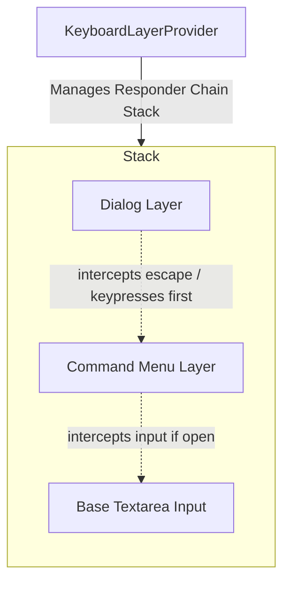
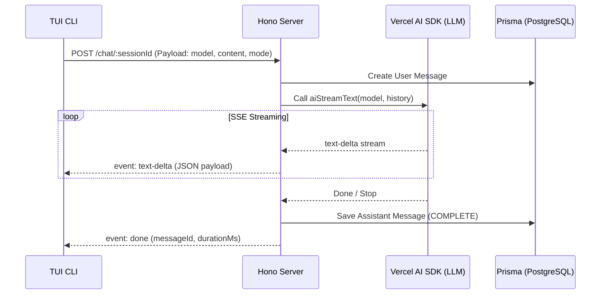

# EXD CODE: Project Analysis

This document provides a comprehensive technical analysis of the **EXD CODE** project, mapping out its architecture, components, core systems, and key patterns.

---

## 1. Project Overview & Architecture

**EXD CODE** is structured as a TypeScript monorepo managed via **Bun Workspaces**. The codebase contains four core packages under the `packages/` directory:

```
exdcode/
├── packages/
│   ├── cli/       # Terminal UI built with OpenTui (React)
│   ├── database/  # Database access layer using Prisma v7
│   ├── server/    # Backend HTTP server built with Hono & Sentry
│   └── shared/    # Shared types, Zod schemas, and model configs
└── package.json   # Monorepo configuration and dev scripts
```

### Technology Stack
*   **Runtime:** [Bun](https://bun.sh/)
*   **CLI Framework:** [OpenTui](https://github.com/opentui) (`@opentui/core` and `@opentui/react` - a React-based terminal UI framework similar to Ink)
*   **HTTP Server:** [Hono](https://hono.dev/)
*   **Database ORM:** [Prisma v7](https://www.prisma.io/) with PostgreSQL (via `@prisma/adapter-pg`)
*   **AI Integration:** [Vercel AI SDK](https://sdk.vercel.ai/) (`ai`)
*   **Error Monitoring:** [Sentry](https://sentry.io/) (`@sentry/hono/bun`)

---

## 2. Package Breakdown

### 📦 `@exdcode/shared`
Provides the common data definitions and schemas utilized by both the backend and client.
*   **Models Config ([models.ts](file:///d:/personal/exd-code/exdcode/packages/shared/src/models.ts)):** Defines supported LLMs (`claude-sonnet-4-6`, `claude-haiku-4-5`, `claude-opus-4-6`, `gpt-5.4`, `gpt-5.4-mini`, `gpt-5.4-nano`, `gemini-3.1-pro-preview`, and `gemini-3.5-flash`), pricing tiers, and providers.
*   **Schemas ([schemas.ts](file:///d:/personal/exd-code/exdcode/packages/shared/src/schemas.ts)):** Defines Zod validators for:
    *   `messagePartSchema`: Parsed message elements (`reasoning`, `tool-call`, `text`).
    *   `chatStreamEventSchema`: Server-Sent Events (SSE) payload formats mapping stream events (`text-delta`, `reasoning-delta`, `tool-call`, `tool-result`, `done`, `error`).

---

### 📦 `@exdcode/database`
Manages the data model and connection pooling.
*   **Prisma v7 Multi-File Schema:** Leverage's Prisma v7's new directory schema configuration. The schemas are split under `prisma/models/` into:
    *   [enums.prisma](file:///d:/personal/exd-code/exdcode/packages/database/prisma/models/enums.prisma): Defines enums (`Role`, `Mode`, `MessageStatus`).
    *   [session.prisma](file:///d:/personal/exd-code/exdcode/packages/database/prisma/models/session.prisma): Defines the `Session` schema (tracks user sessions, paths, title).
    *   [message.prisma](file:///d:/personal/exd-code/exdcode/packages/database/prisma/models/message.prisma): Defines the `Message` schema (stores user, assistant, and error logs).
*   **Database Client ([client.ts](file:///d:/personal/exd-code/exdcode/packages/database/src/client.ts)):** Integrates Postgres connection using `@prisma/adapter-pg`.

---

### 📦 `@exdcode/server`
Handles business logic, AI stream generation, and telemetry.
*   **Sentry Middleware ([index.ts](file:///d:/personal/exd-code/exdcode/packages/server/src/index.ts)):** Integrates `@sentry/hono/bun` to automatically capture errors and track API performance.
*   **Routes:**
    *   [sessions.ts](file:///d:/personal/exd-code/exdcode/packages/server/src/routes/sessions.ts): REST endpoints for creating sessions (`POST /sessions`) and retrieving histories (`GET /sessions` and `GET /sessions/:id`).
    *   [chat.ts](file:///d:/personal/exd-code/exdcode/packages/server/src/routes/chat.ts): Streaming endpoints via Hono SSE (`streamSSE`). Resolves the model client, requests streaming from the Vercel AI SDK (`aiStreamText`), and logs the assistant response to the database on stream completion.

---

### 📦 `@exdcode/cli`
The CLI application providing an interactive console terminal client.
*   **Routing Layout ([index.tsx](file:///d:/personal/exd-code/exdcode/packages/cli/src/index.tsx)):** Built using `react-router` memory router mapping:
    *   `/` -> `Home` screen (input entry point)
    *   `/sessions/new` -> `NewSession` screen (handles backend initialization)
    *   `/sessions/:id` -> `Session` screen (chat history page)
*   **UI Components:**
    *   [InputBar](file:///d:/personal/exd-code/exdcode/packages/cli/src/components/input-bar.tsx): Controls the prompt input, command line status, and triggers overlays.
    *   [CommandMenu](file:///d:/personal/exd-code/exdcode/packages/cli/src/components/command-menu/index.tsx): Interactive overlay command drawer (`/` command triggers).
*   **Providers:**
    *   `ThemeProvider`: Supports dynamic style colors. Includes multiple high-fidelity themes (e.g., Catppuccin Mocha, Tokyo Night, Dracula, Nightfox).
    *   `KeyboardLayerProvider`: Manages hierarchical key bindings so that active modal overlays intercept keyboard shortcuts (like `Escape` or `Ctrl+C`) before bubble-down.
    *   `ToastProvider` / `DialogProvider`: Handles global warnings, modal dialogs, and popups in the TUI stack.

---

## 3. Core Technical Patterns

### 🔑 The Keyboard Layer Focus Stack

Inside the CLI, global key inputs can conflict between multiple UI layers. The `KeyboardLayerProvider` registers/deregisters active responders in a stack. When key events occur, the top-most registered responder handles the action.

### 📡 Server-Sent Events (SSE) AI Streaming Flow


---

## 4. Notable Findings & Code Quality Issues

> [!WARNING]
> During the audit, a critical compilation bug and integration discrepancy were identified in the session screen component.

### 🔴 The `SessionChat` Compilation Bug & Unused Component
In [session.tsx](file:///d:/personal/exd-code/exdcode/packages/cli/src/screens/session.tsx):
1. **Compilation Bug:**
   On lines 72-76:
   ```tsx
   function SessionChat({ session: { session: SessionData } }) {
     const [initialMessages] = useState(() => mapDbMessages(session.messages));
     const { messages, streaming, submit, abort } = useChat(
       session.id,
       initialMessages,
     );
   ```
   *   **The Issue:** The parameter destructures `session` to look for a nested `session` object, binding it to the name `SessionData`. In the body, however, the code references `session.messages` and `session.id` which is **not defined in scope** (only `SessionData` is). This will throw a runtime or compiler error if the component is built.
   *   **The Correct Code:** It should destructure as `function SessionChat({ session }: { session: SessionData })` or bind the value properly.

2. **Unused Component:**
   The `SessionChat` component (which imports and executes the live `useChat` hook for streaming and submitting input) **is completely omitted** from the `Session` component export. The main page render logic is hardcoded as:
   ```tsx
   return (
     <SessionShell onSubmit={() => {}} inputDisabled>
       {session.messages.map((msg) => (
         <ChatMessage key={msg.id} msg={msg} />
       ))}
     </SessionShell>
   );
   ```
   Because `inputDisabled` is hardcoded to `true` and the onSubmit does nothing, users are currently locked in a read-only screen. To make chat interactive, `SessionChat` must be fixed and rendered.
