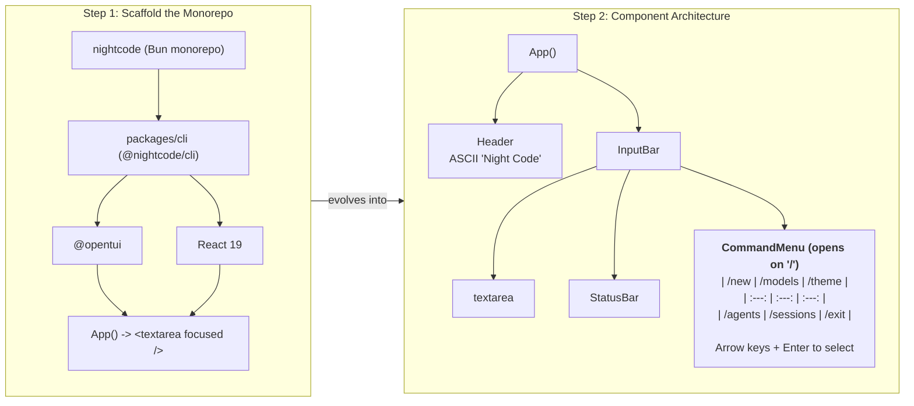

# Project Setup & Component Architecture

Here is how our initial monorepo setup evolves into the component architecture:



To run the application and see the working TUI, run:

```bash
bun run dev:cli
```
