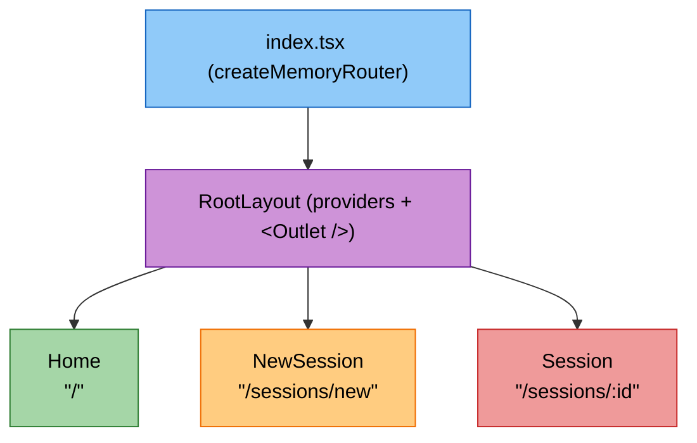

As the application grows to support multiple views (like chatting in a session, viewing session history, or modifying agent settings), a robust client-side router is essential. We implemented `react-router` using a memory router to handle navigation seamlessly within the CLI.

Here is the flow of the new routing architecture, matching **Step 1: Routing & Screens**.

<div align="center">

<br/>
<p><em>Submit message &rarr; navigate with router state: <code>\{ message: text \}</code></em></p>
</div>

## Installation

To enable routing in the CLI, install the `react-router` package:

```bash
bun add react-router --filter @exdcode/cli
```

## Folder Structure

The application layout and individual screens have been moved into their own directories to decouple the routing layer from the UI entry points:

```text
src/
├── layouts/
│   ├── root-layout.tsx
│   └── themed-root.tsx
├── screens/
│   ├── home.tsx
│   ├── new-session.tsx
│   └── session.tsx
└── index.tsx
```

## Implementation

The implementation extracts the providers into a persistent `RootLayout` and delegates screen rendering to `react-router`.

### 1. Root Layout (`layouts/root-layout.tsx`)
The `RootLayout` wraps the entire application in our global providers. The `<Outlet />` renders the active screen, ensuring context like the current Theme and Keyboard Layers are never unmounted during navigation.

```tsx title="packages/cli/src/layouts/root-layout.tsx"
import { Outlet } from "react-router";
import { ToastProvider } from "../providers/toast";
import { DialogProvider } from "../providers/dialog";
import { KeyboardLayerProvider } from "../providers/keyboard-layer";
import { ThemeProvider } from "../providers/theme";
import { ThemedRoot } from "./themed-root";

export function RootLayout() {
  return (
    <ThemeProvider>
      <ToastProvider>
        <KeyboardLayerProvider>
          <DialogProvider>
            <ThemedRoot>
              <Outlet />
            </ThemedRoot>
          </DialogProvider>
        </KeyboardLayerProvider>
      </ToastProvider>
    </ThemeProvider>
  );
}
```

### 2. Themed Root (`layouts/themed-root.tsx`)
This component was extracted from `index.tsx` to handle the global background color injection using the theme context.

```tsx title="packages/cli/src/layouts/themed-root.tsx"
import type { ReactNode } from "react";
import { useTheme } from "../providers/theme";

export function ThemedRoot({ children }: { children: ReactNode }) {
  const { colors } = useTheme();

  return (
    <box
      backgroundColor={colors.background}
      width="100%"
      height="100%"
      flexGrow={1}
    >
      {children}
    </box>
  );
}
```

### 3. Home Screen (`screens/home.tsx`)
The `Home` screen contains the main `InputBar` and the `Header`. When a user submits a prompt, it navigates to `/sessions/new` while passing the prompt text via router state.

```tsx title="packages/cli/src/screens/home.tsx"
import { useCallback } from "react";
import { useNavigate } from "react-router";
import { InputBar } from "../components/input-bar";
import { Header } from "../components/header";

export function Home() {
  const navigate = useNavigate();

  const handleSubmit = useCallback((text: string) => {
    navigate("/sessions/new", { state: { message: text } });
  }, [navigate]);

  return (
    <box
      alignItems="center"
      justifyContent="center"
      flexGrow={1}
      gap={2}
      position="relative"
      width="100%"
      height="100%"
    >
      <Header />
      <box width="100%" maxWidth={90} paddingX={2}>
        <InputBar onSubmit={handleSubmit} />
      </box>
    </box>
  );
}
```

### 4. New Session Screen (`screens/new-session.tsx`)
Intercepts the navigation state and displays a loading indicator while creating a new session. If no state is provided (e.g. user navigated there directly), it safely redirects back to `/`.

```tsx title="packages/cli/src/screens/new-session.tsx"
import { useLocation, useNavigate } from "react-router";
import { useTheme } from "../providers/theme";
import { useEffect } from "react";

export function NewSession() {
  const navigate = useNavigate();
  const location = useLocation();

  const state = location.state as { message?: string } | null;

  useEffect(() => {
    if (!state?.message) navigate("/", { replace: true });
  }, [state, navigate]);

  if (!state?.message) return null;

  return (
    <box flexGrow={1} padding={2} flexDirection="column" gap={1}>
      <text>Creating session...</text>
      <text>{state.message}</text>
    </box>
  );
}
```

### 5. Session Screen (`screens/session.tsx`)
A dynamic route screen that retrieves the `:id` parameter from the URL using `useParams`.

```tsx title="packages/cli/src/screens/session.tsx"
import { useParams } from "react-router";

export function Session() {
  const { id } = useParams();

  return (
    <box flexGrow={1} padding={2}>
      <text>Session {id}</text>
    </box>
  );
}
```

## Integration & Changes

To support the router, the application entry point was completely refactored. The hardcoded layout of components was replaced with a `createMemoryRouter` definition that maps URL paths to the newly created screen components.

### `index.tsx`

```diff title="packages/cli/src/index.tsx"
-import { Header } from "./components/header";
-import { StatusBar } from "./components/status-bar";
-import { InputBar } from "./components/input-bar";
-import { ToastProvider } from "./providers/toast";
-import { KeyboardLayerProvider } from "./providers/keyboard-layer";
-import { DialogProvider } from "./providers/dialog";
-import { ThemeProvider, useTheme } from "./providers/theme";
+import { createMemoryRouter, RouterProvider } from "react-router";
+import { RootLayout } from "./layouts/root-layout";
+import { Home } from "./screens/home";
 
-function ThemedRoot() { /* ... */ }
+const router = createMemoryRouter([
+  {
+    path: "/",
+    element: <RootLayout />,
+    children: [
+      {
+        index: true,
+        element: <Home />,
+      },
+      {
+        path: "sessions/new",
+        element: <NewSession /> // Mapped here internally
+      },
+      {
+        path: "sessions/:id",
+        element: <Session /> // Dynamic route
+      },
+    ],
+  },
+]);
 
 function App() {
-  return (
-    <ThemeProvider>
-      <KeyboardLayerProvider>
-        <DialogProvider>
-          <ToastProvider>
-            <ThemedRoot />
-          </ToastProvider>
-        </DialogProvider>
-      </KeyboardLayerProvider>
-    </ThemeProvider>
-  );
+  return <RouterProvider router={router} />;
 }
```
