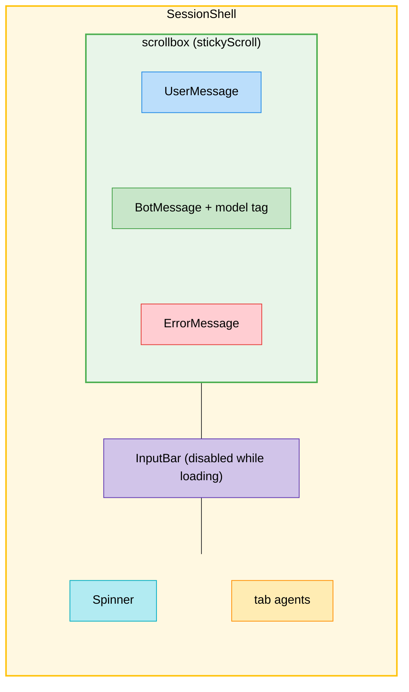

The core interaction of the CLI takes place in the Session screen. We implemented a unified `SessionShell` layout that manages a sticky scrolling message list, a dynamic input bar, and loading states.

Here is the flow of the new session interface architecture, matching **Step 2: Session Screen UI**.

<div align="center">

</div>

## Installation

We added a beautiful animated spinner for loading states:

```bash
bun add opentui-spinner --filter @exdcode/cli
```

## Folder Structure

The messaging components were separated into their own folder to keep the root components clean:

```text
src/
└── components/
    ├── messages/
    │   ├── bot-message.tsx
    │   ├── error-message.tsx
    │   ├── index.tsx
    │   └── user-message.tsx
    ├── session-shell.tsx
    └── spinner.tsx
```

## Implementation

### 1. Session Shell (`session-shell.tsx`)
This acts as a reusable layout wrapper for both `NewSession` and `Session` routes. It creates a flex layout with a sticky `scrollbox` for the chat history, placing the `InputBar` and status row safely at the bottom.

```tsx title="packages/cli/src/components/session-shell.tsx"
import { TextAttributes } from "@opentui/core";
import type { ReactNode } from "react";
import { InputBar } from "./input-bar";
import { Spinner } from "./spinner";

type Props = {
  children?: ReactNode;
  onSubmit: (text: string) => void;
  inputDisabled?: boolean;
  loading?: boolean;
};

export function SessionShell({
  children,
  onSubmit,
  inputDisabled = false,
  loading = false,
}: Props) {
  return (
    <box
      flexDirection="column"
      flexGrow={1}
      width="100%"
      height="100%"
      paddingY={1}
      paddingX={2}
      gap={1}
    >
      <scrollbox flexGrow={1} width="100%" stickyScroll stickyStart="bottom">
        <box gap={1}>{children}</box>
      </scrollbox>

      <box flexShrink={0}>
        <InputBar onSubmit={onSubmit} disabled={inputDisabled} />
      </box>

      <box
        flexShrink={0}
        flexDirection="row"
        justifyContent="space-between"
        width="100%"
        height={1}
        gap={2}
        paddingLeft={1}
      >
        <box flexDirection="row" alignItems="center" gap={2}>
          {loading ? <Spinner /> : null}
        </box>
        <box flexDirection="row" gap={1} flexShrink={0} marginLeft="auto">
          <text>tab</text>
          <text attributes={TextAttributes.DIM}>agents</text>
        </box>
      </box>
    </box>
  );
}
```

### 2. Message Components (`messages/`)
The `messages/` directory provides standardized UI blocks for rendering chat history.

#### BotMessage
Displays AI responses and includes a tag denoting the model that generated it.

```tsx title="packages/cli/src/components/messages/bot-message.tsx"
import { useTheme } from "../../providers/theme";

export function BotMessage({ content, model }: Props) {
  const { colors } = useTheme();

  return (
    <box width="100%" alignItems="center">
      <box paddingY={1} width="100%">
        <box paddingX={3} width="100%">
          <text>{content}</text>
        </box>
      </box>
      <box paddingX={3} paddingY={1} gap={1} width="100%">
        <box flexDirection="row" gap={2}>
          <text fg={colors.primary}>◉</text>
          <text>{model}</text>
        </box>
      </box>
    </box>
  );
}
```

#### UserMessage
Renders the user's prompt using the primary theme color.

```tsx title="packages/cli/src/components/messages/user-message.tsx"
export function UserMessage({ message }: Props) {
  const { colors } = useTheme();

  return (
    <box width="100%" alignItems="center">
      <box
        border={["left"]}
        borderColor={colors.primary}
        width="100%"
        customBorderChars={SplitBorderChars}
      >
        <box
          justifyContent="center"
          paddingX={2}
          paddingY={1}
          backgroundColor={colors.surface}
          width="100%"
        >
          <text>{message}</text>
        </box>
      </box>
    </box>
  );
}
```

#### Index (Barrel File)
Exports the message components for cleaner imports in the screens.

```tsx title="packages/cli/src/components/messages/index.tsx"
export { ErrorMessage } from "./error-message";
export { UserMessage } from "./user-message";
export { BotMessage } from "./bot-message";
```

#### ErrorMessage
Renders failed execution steps or API errors with a distinct left border.

```tsx title="packages/cli/src/components/messages/error-message.tsx"
export function ErrorMessage({ message }: Props) {
  const { colors } = useTheme();

  return (
    <box width="100%" alignItems="center">
      <box
        border={["left"]}
        borderColor={colors.error}
        width="100%"
        customBorderChars={SplitBorderChars}
      >
        <box
          justifyContent="center"
          paddingX={2}
          paddingY={1}
          backgroundColor={colors.surface}
          width="100%"
        >
          <text attributes={TextAttributes.DIM}>{message}</text>
        </box>
      </box>
    </box>
  );
}
```

#### Spinner
A themed wrapper around `opentui-spinner` that matches the global `colors.primary`.

```tsx title="packages/cli/src/components/spinner.tsx"
import "opentui-spinner/react";
import { useTheme } from "../providers/theme";

export function Spinner() {
  const { colors } = useTheme();
  return <spinner name="aesthetic" color={colors.primary}></spinner>;
}
```

## Integration & Changes

The layout screens were updated to consume the new `SessionShell` and display the message stack.

### `new-session.tsx`
The `NewSession` component demonstrates how the shell operates by displaying the user's initial prompt and triggering a simulated AI reply layout with the spinner active.

```diff title="packages/cli/src/screens/new-session.tsx"
-import { useLocation, useNavigate } from "react-router";
-import { useTheme } from "../providers/theme";
-import { useEffect } from "react";
+import { useLocation, useNavigate } from "react-router";
+import { useEffect } from "react";
+import { SessionShell } from "../components/session-shell";
+import { ErrorMessage, UserMessage, BotMessage } from "../components/messages";
 
 export function NewSession() {
   /* ... route state logic ... */
 
   return (
-    <box flexGrow={1} padding={2} flexDirection="column" gap={1}>
-      <text>Creating session...</text>
-      <text>{state.message}</text>
-    </box>
+    <SessionShell onSubmit={() => {}} inputDisabled loading>
+      <UserMessage message={state.message} />
+      <BotMessage
+        content="This is sample agent response to demonstrate the message layout."
+        model="peel"
+      />
+      <ErrorMessage message="This is a sample error message" />
+    </SessionShell>
   );
 }
```

### `session.tsx`
The main `Session` route was completely refactored to mount the `SessionShell` wrapper instead of a simple text box.

```diff title="packages/cli/src/screens/session.tsx"
-import { useParams } from "react-router";
+import { SessionShell } from "../components/session-shell";
 
 export function Session() {
-  const { id } = useParams();
-
-  return (
-    <box flexGrow={1} padding={2}>
-      <text>Session {id}</text>
-    </box>
-  );
+  return <SessionShell onSubmit={() => {}} inputDisabled loading />;
 }
```

