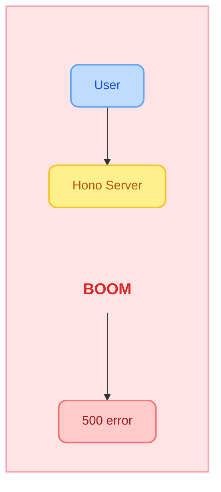
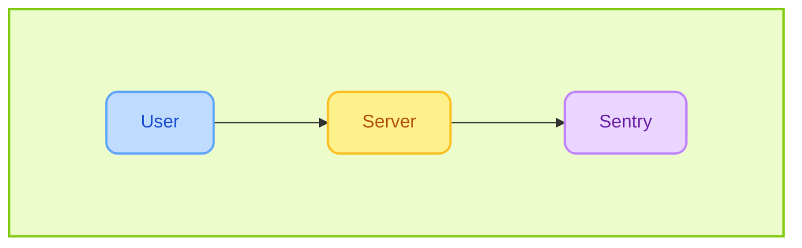
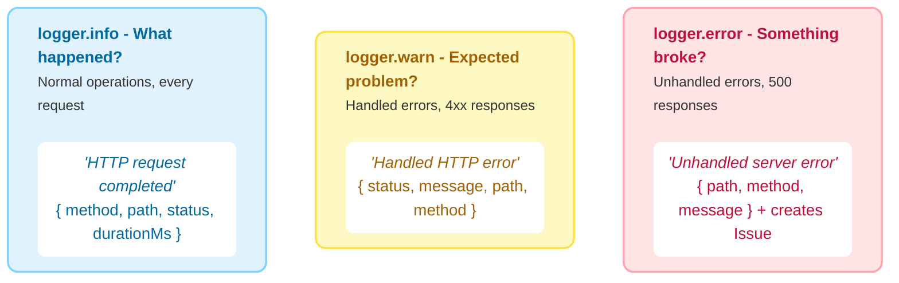

Before integrating Sentry, diagnosing errors in production can be extremely difficult.

### WITHOUT Sentry

**You have:**
- no idea which route failed
- no stack trace
- no request context
- no idea how often it happens

*just an angry user on Twitter.*

---

### WITH Sentry

But once you integrate Sentry into your Hono server, the picture changes entirely:

**With Sentry you get:**
- **Issue**: 'My first Sentry error!' + full stack trace
- **Trace**: POST /sessions 487ms status 500
- **Logs**: filterable by method, path, status, duration
- **Frequency**: 47 events, 12 users affected

*You know exactly what broke, where, and how often.*

---

### How it works
*Sentry is the FIRST middleware in the Hono request flow*

```mermaid
flowchart LR
    Req["Request"]
    Sentry["sentry()"]
    Timer["request timer"]
    Route["your route handler"]
    Error["app.onError()"]
    Res["Response"]
    
    Req --> Sentry
    Sentry --> Timer
    Timer --> Route
    Route --> Error
    Error --> Res
    
    Error -. "thrown error caught here" .-> Sentry
    
    style Req fill:#BFDBFE,stroke:#60A5FA,color:#1D4ED8,stroke-width:2px,rx:10,ry:10
    style Sentry fill:#E9D5FF,stroke:#C084FC,color:#6B21A8,stroke-width:2px,rx:10,ry:10
    style Timer fill:#FEF08A,stroke:#FBBF24,color:#B45309,stroke-width:2px,rx:10,ry:10
    style Route fill:#BBF7D0,stroke:#22C55E,color:#14532D,stroke-width:2px,rx:10,ry:10
    style Error fill:#FFEDD5,stroke:#FDBA74,color:#C2410C,stroke-width:2px,rx:10,ry:10
    style Res fill:#BFDBFE,stroke:#60A5FA,color:#1D4ED8,stroke-width:2px,rx:10,ry:10
    
    linkStyle 5 stroke:#EF4444,stroke-width:2px,color:#EF4444,stroke-dasharray: 5 5
```

 

  No try/catch needed - middleware position does the work

---

### What to log (three levels, three questions)

