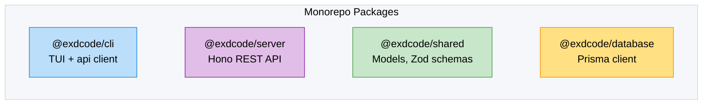

As outlined in **Step 4: Packages & Database**, the backend infrastructure is decoupled into three dedicated packages in our monorepo alongside the CLI client:

```mermaid
flowchart LR
    subgraph Monorepo["Monorepo Packages"]
        direction LR
        CLI["@exdcode/cli<br>TUI + api client"]
        Server["@exdcode/server<br>Hono REST API"]
        Shared["@exdcode/shared<br>Models, Zod schemas"]
        DB["@exdcode/database<br>Prisma client"]

        CLI ~~~ Server
        Server ~~~ Shared
        Shared ~~~ DB
    end

    style Monorepo fill:#F5F7FA,stroke:#CFD8DC,color:#000
    style CLI fill:#BBDEFB,stroke:#1E88E5,color:#000
    style Server fill:#E1BEE7,stroke:#8E24AA,color:#000
    style Shared fill:#C8E6C9,stroke:#43A047,color:#000
    style DB fill:#FFE082,stroke:#FF8F00,color:#000
```

