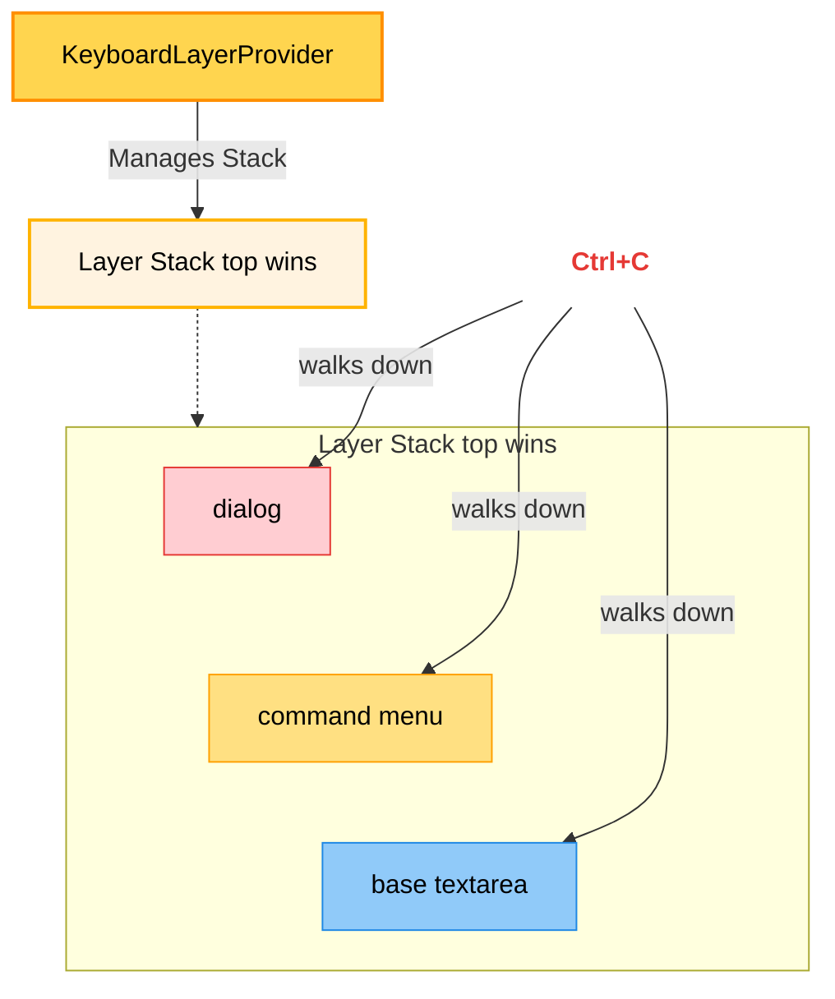

# Dialog & Keyboard Layers

As the CLI adds more interactive overlays (like a command menu and full-screen dialogs), we need a robust system to manage keyboard focus and global hotkeys. The Keyboard Layer system manages a stack of active UI layers, ensuring that keypresses (like `Escape` or `Ctrl+C`) are routed to the top-most active component.

## Folder Structure

Two new provider directories were introduced to handle dialogs and the keyboard stack:

```text
src/
└── providers/
    ├── dialog/
    │   ├── index.tsx
    │   └── types.ts
    └── keyboard-layer/
        └── index.tsx
```

## Architecture

This corresponds to **Step 2: Dialog & Keyboard Layers**. The `KeyboardLayerProvider` maintains a stack of active components. When `Ctrl+C` is pressed, it walks down the stack, giving the top-most active layer the chance to intercept the exit signal.

<div align="center">

</div>

## Implementation

### 1. Keyboard Layer

The `KeyboardLayerProvider` exposes `push`, `pop`, `isTopLayer`, and `setResponder`. It globally listens for `Ctrl+C` and delegates it down the layer stack.

```tsx title="packages/cli/src/providers/keyboard-layer/index.tsx"
import {
  createContext,
  useContext,
  useState,
  useCallback,
  useRef,
  type ReactNode,
} from "react";
import { useKeyboard, useRenderer } from "@opentui/react";

type Responder = () => boolean;

type KeyboardLayerContextValue = {
  push: (id: string, responder?: Responder) => void;
  pop: (id: string) => void;
  isTopLayer: (id: string) => boolean;
  setResponder: (id: string, responder: Responder | null) => void;
};

const KeyboardLayerContext = createContext<KeyboardLayerContextValue | null>(
  null,
);

export function KeyboardLayerProvider({ children }: { children: ReactNode }) {
  const [stack, setStack] = useState<string[]>(["base"]);
  const stackRef = useRef(stack);
  stackRef.current = stack;

  const responders = useRef<Map<string, Responder>>(new Map());
  const renderer = useRenderer();

  const push = useCallback((id: string, responder?: Responder) => {
    if (responder) {
      responders.current.set(id, responder);
    }

    setStack((prev) => {
      if (prev.includes(id)) {
        return prev;
      }

      return [...prev, id];
    });
  }, []);

  const pop = useCallback((id: string) => {
    responders.current.delete(id);
    setStack((prev) => prev.filter((layer) => layer !== id));
  }, []);

  const isTopLayer = useCallback(
    (id: string) => {
      return stack.length === 0 || stack[stack.length - 1] === id;
    },
    [stack],
  );

  const setResponder = useCallback(
    (id: string, responder: Responder | null) => {
      if (responder) {
        responders.current.set(id, responder);
      } else {
        responders.current.delete(id);
      }
    },
    [],
  );

  // Single ctrl+c handler that walks the responder chain
  useKeyboard((key) => {
    if (!key.ctrl || key.name !== "c") return;

    const currentStack = stackRef.current;
    for (let i = currentStack.length - 1; i >= 0; i--) {
      const layerId = currentStack[i]!;
      const responder = responders.current.get(layerId);

      if (responder && responder()) {
        return;
      }
    }

    // No responder handled it - exit
    renderer.destroy();
  });

  return (
    <KeyboardLayerContext.Provider
      value={{ push, pop, isTopLayer, setResponder }}
    >
      {children}
    </KeyboardLayerContext.Provider>
  );
}

export function useKeyboardLayer() {
  const context = useContext(KeyboardLayerContext);
  if (!context) {
    throw new Error(
      "useKeyboardLayer must be used within a KeyboardLayerProvider",
    );
  }

  return context;
}
```

### 2. Dialog Types

Defines the structure of the dialog payload.

```typescript title="packages/cli/src/providers/dialog/types.ts"
import type { ReactNode } from "react";

export type DialogConfig = {
  title: string;
  children: ReactNode;
};
```

### 3. Dialog Provider

The `DialogProvider` wraps the app and exposes `open` and `close`. When opened, it pushes itself to the `KeyboardLayer` stack.

```tsx title="packages/cli/src/providers/dialog/index.tsx"
import { createContext, useContext, useState, useCallback } from "react";
import type { ReactNode } from "react";
import { TextAttributes, RGBA, dim } from "@opentui/core";
import { useKeyboard, useTerminalDimensions } from "@opentui/react";
import type { DialogConfig } from "./types";
import { useKeyboardLayer } from "../keyboard-layer";

export type DialogContextValue = {
  open: (config: DialogConfig) => void;
  close: () => void;
};

const DialogContext = createContext<DialogContextValue | null>(null);

export function useDialog(): DialogContextValue {
  const value = useContext(DialogContext);
  if (!value) {
    throw new Error("useDialog must be within a DialogProvider");
  }

  return value;
}

type DialogProviderProps = {
  children: ReactNode;
};

export function DialogProvider({ children }: DialogProviderProps) {
  const [currentDialog, setCurrentDialog] = useState<DialogConfig | null>(null);
  const { push, pop } = useKeyboardLayer();

  const close = useCallback(() => {
    setCurrentDialog(null);
    pop("dialog");
  }, [pop]);

  const open = useCallback(
    (config: DialogConfig) => {
      setCurrentDialog(config);
      push("dialog", () => {
        close();
        return true;
      });
    },
    [push, close],
  );

  const value: DialogContextValue = {
    open,
    close,
  };

  return (
    <DialogContext.Provider value={value}>
      {children}
      <Dialog currentDialog={currentDialog} close={close} />
    </DialogContext.Provider>
  );
}

type DialogProps = {
  currentDialog: DialogConfig | null;
  close: () => void;
};

function Dialog({ currentDialog, close }: DialogProps) {
  const { isTopLayer } = useKeyboardLayer();
  const dimensions = useTerminalDimensions();

  useKeyboard((key) => {
    if (!currentDialog || !isTopLayer("dialog")) return;

    if (key.name === "escape") {
      close();
    }
  });

  if (!currentDialog) {
    return null;
  }
  const { title, children } = currentDialog;

  return (
    <box
      position="absolute"
      left={0}
      top={0}
      width={dimensions.width}
      height={dimensions.height}
      justifyContent="center"
      alignItems="center"
      backgroundColor={RGBA.fromInts(0, 0, 0, 150)}
      zIndex={100}
      onMouseDown={() => close()}
    >
      <box
        width={Math.min(60, dimensions.width - 4)}
        height="auto"
        backgroundColor="#1A1A24"
        paddingX={4}
        paddingY={1}
        flexDirection="column"
        gap={1}
        onMouseDown={(e) => e.stopPropagation()}
      >
        <box
          paddingBottom={1}
          flexDirection="row"
          alignItems="center"
          justifyContent="space-between"
        >
          <text attributes={TextAttributes.BOLD}>{title}</text>
          <text attributes={TextAttributes.DIM} onMouseDown={() => close()}>
            esc
          </text>
        </box>
        <box flexGrow={1}>{children}</box>
      </box>
    </box>
  );
}
```

## Integration

### 1. Global Providers
The main app is wrapped in the new providers. The `KeyboardLayerProvider` must be the outermost so that `Dialog` can use it.

```tsx title="packages/cli/src/index.tsx"
function App() {
  return (
    <KeyboardLayerProvider>
      <DialogProvider>
        <ToastProvider>
          {/* Layout Elements */}
        </ToastProvider>
      </DialogProvider>
    </KeyboardLayerProvider>
  );
}
```

### 2. Contextual Types
The `DialogContextValue` is passed into `CommandContext` so slash commands can open dialogs.

```tsx title="packages/cli/src/components/command-menu/types.ts"
export type CommandContext = {
  exit: () => void;
  toast: ToastContextValue;
  dialog: DialogContextValue;
};
```

### 3. Command Data
Commands now utilize the `dialog.open` method to trigger full-screen interaction modals.

```tsx title="packages/cli/src/components/command-menu/commands.tsx"
export const COMMANDS: Command[] = [
  {
    name: "agents",
    description: "Switch agents",
    value: "/agents",
    action: (ctx) => {
      ctx.dialog.open({
        title: "Select Mode",
        children: <text>Agent selection coming soon...</text>,
      });
    },
  },
  {
    name: "models",
    description: "Select AI model for generation",
    value: "/models",
    action: (ctx) => {
      ctx.dialog.open({
        title: "Select Model",
        children: <text>Model selection coming soon...</text>,
      });
    },
  },
];
```

## Changes & Refactoring

Because adding a global keyboard layer system changes how hotkeys are intercepted, several components required refactoring to participate in the stack:

### 1. Command Menu
The command menu was updated to explicitly declare itself as a layer when opened. It now validates it is the top layer before capturing `escape` or arrow keys.

```tsx title="packages/cli/src/components/command-menu/use-command-menu.ts"
export function useCommandMenu(): UseCommandMenuReturn {
  const { push, pop, isTopLayer } = useKeyboardLayer();

  const close = () => {
    setShowCommandMenu(false);
    pop("command");
  };

  const handleContentChange = (text: string) => {
    // ... typing logic ...
    const prefix = text.startsWith("/") ? text.slice(1) : null;
    if (prefix !== null && !prefix.includes(" ")) {
      setShowCommandMenu(true);
      push("command", () => {
        close();
        return true;
      });
    } else {
      close(); // Replaced setShowCommandMenu(false)
    }
  };

  const resolveCommand = (index: number): Command | undefined => {
    const command = filteredCommands[index];
    if (command) {
      close(); // Replaced setShowCommandMenu(false)
    }
    return command;
  };

  // Only handle keys if we are top layer
  useKeyboard((key) => {
    if (!showCommandMenu || !isTopLayer("command")) return;
    
    if (key.name === "escape") {
      key.preventDefault();
      close(); // Replaced setShowCommandMenu(false)
    }
    // ... up and down arrows logic ...
  });
}
```

### 2. Input Bar Fallback
The `InputBar` serves as the `base` layer of our application. We refactored it to register a layer responder. This ensures that pressing `Ctrl+C` clears the textarea if it has content, rather than instantly killing the CLI.

```tsx title="packages/cli/src/components/input-bar.tsx"
export function InputBar({ onSubmit, disabled = false }: Props) {
  const dialog = useDialog();
  const { isTopLayer, setResponder } = useKeyboardLayer();

  // Register the base layer responder for ctrl+c dismissal
  useEffect(() => {
    setResponder("base", () => {
      if (disabled) return false;
      
      const textarea = textareaRef.current;
      if (textarea && textarea.plainText.length > 0) {
        textarea.setText(""); // Intercept Ctrl+C to clear text instead of exiting
        return true;
      }
      return false;
    });

    return () => setResponder("base", null);
  }, [disabled, setResponder]);
  
  // Execute commands with dialog instance injected
  const handleCommand = useCallback((command) => {
    if (command.action) {
      command.action({ exit: () => renderer.destroy(), toast, dialog });
    }
  }, [renderer, toast, dialog]);

  // The textarea is only focused when the base or command menu is active
  return (
    <textarea
      focused={!disabled && (isTopLayer("base") || isTopLayer("command"))}
      // ...
    />
  );
}
```
