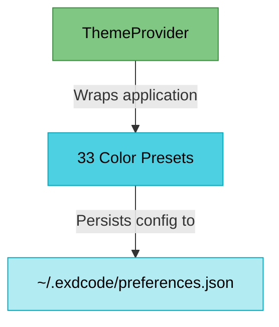
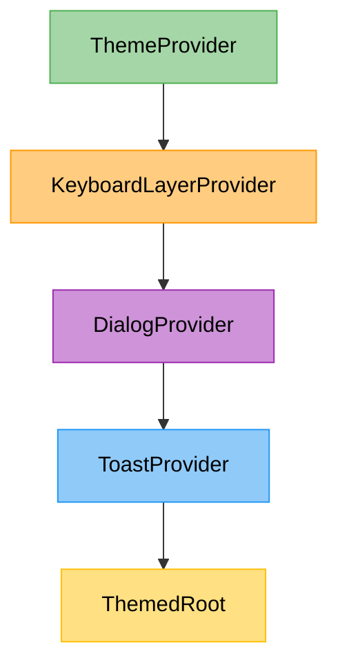

We implemented a global theming system with dozens of beautiful built-in color palettes. Users can preview themes on the fly and save their preferences permanently to their local filesystem (`~/.exdcode/preferences.json`).

## Folder Structure

The global theme system introduces a new provider and a dedicated dialog component for selection:

```text
src/
├── theme.ts
├── providers/
│   └── theme/
│       └── index.tsx
└── components/
    ├── dialog-search-list.tsx
    └── dialog/
        └── theme-dialog.tsx
```

Here is the flow of how Themes are structured, matching **Step 3: Theme System**.

<div align="center">

</div>

When nesting the global providers in `index.tsx`, `ThemeProvider` sits at the very top of the tree, enabling `useTheme()` for all child providers (including layers, dialogs, toasts, and the root UI).

<div align="center">

</div>

## Implementation

The theme system is built around a centralized `ThemeProvider` that reads/writes from the filesystem and injects a `Theme` object into React Context.

### 1. Theme Configuration
`packages/cli/src/theme.ts` defines the types and 33 beautiful color palettes, including Catppuccin, Dracula, and Nightfox.

```typescript title="packages/cli/src/theme.ts"
export type ThemeColors = {
  primary: string;
  planMode: string;
  selection: string;
  thinking: string;
  success: string;
  error: string;
  info: string;
  background: string;
  surface: string;
  dialogSurface: string;
  thinkingBorder: string;
  dimSeparator: string;
};

export type Theme = {
  name: string;
  colors: ThemeColors;
};

export const THEMES: Theme[] = [
  {
    name: "Nightfox",
    colors: {
      primary: "#56D6C2",
      planMode: "#CF8EF4",
      selection: "#89B4FA",
      thinking: "#CF8EF4",
      success: "#82E0AA",
      error: "#E74C5E",
      info: "#56D6C2",
      background: "#0D0D12",
      surface: "#1A1A24",
      dialogSurface: "#0A0A10",
      thinkingBorder: "#34344A",
      dimSeparator: "#4E4E66",
    },
  },
  {
    name: "Catppuccin Mocha",
    colors: {
      primary: "#E0AF68",
      planMode: "#9D7CD8",
      selection: "#B4A4E8",
      thinking: "#9D7CD8",
      success: "#73DACA",
      error: "#F7768E",
      info: "#7AA2F7",
      background: "#11111B",
      surface: "#1E1E2E",
      dialogSurface: "#13131D",
      thinkingBorder: "#45475A",
      dimSeparator: "#585B70",
    },
  },
  {
    name: "Dracula",
    colors: {
      primary: "#BD93F9",
      planMode: "#FF79C6",
      selection: "#6272A4",
      thinking: "#FF79C6",
      success: "#50FA7B",
      error: "#FF5555",
      info: "#8BE9FD",
      background: "#282A36",
      surface: "#343746",
      dialogSurface: "#21222C",
      thinkingBorder: "#6272A4",
      dimSeparator: "#44475A",
    },
  },
  {
    name: "Monokai Pro",
    colors: {
      primary: "#FFD866",
      planMode: "#AB9DF2",
      selection: "#AB9DF2",
      thinking: "#AB9DF2",
      success: "#A9DC76",
      error: "#FF6188",
      info: "#78DCE8",
      background: "#2D2A2E",
      surface: "#403E41",
      dialogSurface: "#221F22",
      thinkingBorder: "#5B595C",
      dimSeparator: "#727072",
    },
  },
  {
    name: "Tokyo Night",
    colors: {
      primary: "#7AA2F7",
      planMode: "#BB9AF7",
      selection: "#7AA2F7",
      thinking: "#BB9AF7",
      success: "#9ECE6A",
      error: "#F7768E",
      info: "#7DCFFF",
      background: "#1A1B26",
      surface: "#24283B",
      dialogSurface: "#16161E",
      thinkingBorder: "#3B4261",
      dimSeparator: "#565F89",
    },
  },
  {
    name: "Nord",
    colors: {
      primary: "#EBCB8B",
      planMode: "#B48EAD",
      selection: "#81A1C1",
      thinking: "#B48EAD",
      success: "#A3BE8C",
      error: "#BF616A",
      info: "#88C0D0",
      background: "#2E3440",
      surface: "#3B4252",
      dialogSurface: "#272C36",
      thinkingBorder: "#4C566A",
      dimSeparator: "#616E88",
    },
  },
  {
    name: "Synthwave",
    colors: {
      primary: "#F472B6",
      planMode: "#A855F7",
      selection: "#E879F9",
      thinking: "#A855F7",
      success: "#4ADE80",
      error: "#EF4444",
      info: "#C084FC",
      background: "#0A0A0A",
      surface: "#171717",
      dialogSurface: "#0D0D0D",
      thinkingBorder: "#404040",
      dimSeparator: "#525252",
    },
  },
  {
    name: "Midnight Sky",
    colors: {
      primary: "#6AAEF5",
      planMode: "#B07AE8",
      selection: "#8CC4F0",
      thinking: "#B07AE8",
      success: "#58CEA0",
      error: "#E8555A",
      info: "#7DCFFF",
      background: "#0A0E14",
      surface: "#141A22",
      dialogSurface: "#0E1319",
      thinkingBorder: "#4A5A6E",
      dimSeparator: "#607080",
    },
  },
  {
    name: "Neon Nights",
    colors: {
      primary: "#E86ACA",
      planMode: "#5ED4E8",
      selection: "#D48EE0",
      thinking: "#5ED4E8",
      success: "#4ED89C",
      error: "#F04858",
      info: "#E86ACA",
      background: "#0C0814",
      surface: "#18122A",
      dialogSurface: "#110C1E",
      thinkingBorder: "#5C4878",
      dimSeparator: "#745E90",
    },
  },
  {
    name: "Hacker Terminal",
    colors: {
      primary: "#00E5A0",
      planMode: "#D946EF",
      selection: "#2DD4BF",
      thinking: "#D946EF",
      success: "#4ADE80",
      error: "#F43F5E",
      info: "#06B6D4",
      background: "#050505",
      surface: "#131313",
      dialogSurface: "#0A0A0A",
      thinkingBorder: "#2E2E2E",
      dimSeparator: "#454545",
    },
  },
  {
    name: "One Dark",
    colors: {
      primary: "#CBAACB",
      planMode: "#55B6C2",
      selection: "#98C379",
      thinking: "#55B6C2",
      success: "#98C379",
      error: "#E06C75",
      info: "#61AFEF",
      background: "#1E2127",
      surface: "#282C34",
      dialogSurface: "#191C21",
      thinkingBorder: "#3E4451",
      dimSeparator: "#5C6370",
    },
  },
  {
    name: "Xcode Midnight",
    colors: {
      primary: "#FF7AB2",
      planMode: "#6BDFFF",
      selection: "#ACF2E4",
      thinking: "#6BDFFF",
      success: "#83C9BC",
      error: "#FF6961",
      info: "#B281EB",
      background: "#1F1F24",
      surface: "#2A2A30",
      dialogSurface: "#18181D",
      thinkingBorder: "#3E3E45",
      dimSeparator: "#57575F",
    },
  },
  {
    name: "Catppuccin Frappe",
    colors: {
      primary: "#8CAAEE",
      planMode: "#CA9EE6",
      selection: "#A6D189",
      thinking: "#CA9EE6",
      success: "#A6D189",
      error: "#E78284",
      info: "#85C1DC",
      background: "#232634",
      surface: "#303446",
      dialogSurface: "#1E2030",
      thinkingBorder: "#51576D",
      dimSeparator: "#626880",
    },
  },
  {
    name: "Vercel Dark",
    colors: {
      primary: "#8B5CF6",
      planMode: "#EC4899",
      selection: "#6366F1",
      thinking: "#EC4899",
      success: "#10B981",
      error: "#EF4444",
      info: "#3B82F6",
      background: "#030712",
      surface: "#111827",
      dialogSurface: "#060C18",
      thinkingBorder: "#1F2937",
      dimSeparator: "#374151",
    },
  },
  {
    name: "Material Ocean",
    colors: {
      primary: "#82AAFF",
      planMode: "#C792EA",
      selection: "#717CB4",
      thinking: "#C792EA",
      success: "#C3E88D",
      error: "#FF5370",
      info: "#89DDFF",
      background: "#0F111A",
      surface: "#1A1C2A",
      dialogSurface: "#090B16",
      thinkingBorder: "#3B3F5C",
      dimSeparator: "#4B5178",
    },
  },
  {
    name: "Dusk",
    colors: {
      primary: "#C9A0DC",
      planMode: "#F2B866",
      selection: "#E8889A",
      thinking: "#F2B866",
      success: "#7ED4A6",
      error: "#E25A6E",
      info: "#C9A0DC",
      background: "#110D16",
      surface: "#1E1726",
      dialogSurface: "#15101C",
      thinkingBorder: "#6B5880",
      dimSeparator: "#7E6E94",
    },
  },
  {
    name: "Ocean",
    colors: {
      primary: "#3B9ECF",
      planMode: "#E0A846",
      selection: "#6CC9A1",
      thinking: "#E0A846",
      success: "#A8D45F",
      error: "#D94F4F",
      info: "#3B9ECF",
      background: "#0B1218",
      surface: "#152028",
      dialogSurface: "#0F181F",
      thinkingBorder: "#4A6A7A",
      dimSeparator: "#5E7888",
    },
  },
  {
    name: "Soft Midnight",
    colors: {
      primary: "#60A5FA",
      planMode: "#F9A8D4",
      selection: "#93C5FD",
      thinking: "#F9A8D4",
      success: "#6EE7B7",
      error: "#FCA5A5",
      info: "#67E8F9",
      background: "#0F172A",
      surface: "#1E293B",
      dialogSurface: "#0C1322",
      thinkingBorder: "#334155",
      dimSeparator: "#475569",
    },
  },
  {
    name: "Minimal Dark",
    colors: {
      primary: "#A78BFA",
      planMode: "#38BDF8",
      selection: "#818CF8",
      thinking: "#38BDF8",
      success: "#34D399",
      error: "#FB7185",
      info: "#22D3EE",
      background: "#09090B",
      surface: "#18181B",
      dialogSurface: "#0C0C0F",
      thinkingBorder: "#3F3F46",
      dimSeparator: "#52525B",
    },
  },
  {
    name: "Solarized Dark",
    colors: {
      primary: "#268BD2",
      planMode: "#6C71C4",
      selection: "#6BC0CC",
      thinking: "#6C71C4",
      success: "#859900",
      error: "#DC322F",
      info: "#2AA198",
      background: "#002B36",
      surface: "#073642",
      dialogSurface: "#00212B",
      thinkingBorder: "#586E75",
      dimSeparator: "#657B83",
    },
  },
  {
    name: "Gruvbox Dark",
    colors: {
      primary: "#FABD2F",
      planMode: "#D3869B",
      selection: "#FABD2F",
      thinking: "#D3869B",
      success: "#B8BB26",
      error: "#FB4934",
      info: "#83A598",
      background: "#282828",
      surface: "#3C3836",
      dialogSurface: "#1D2021",
      thinkingBorder: "#504945",
      dimSeparator: "#665C54",
    },
  },
  {
    name: "Rosé Pine",
    colors: {
      primary: "#EBBCBA",
      planMode: "#C4A7E7",
      selection: "#C4A7E7",
      thinking: "#C4A7E7",
      success: "#31748F",
      error: "#EB6F92",
      info: "#9CCFD8",
      background: "#191724",
      surface: "#1F1D2E",
      dialogSurface: "#16141F",
      thinkingBorder: "#26233A",
      dimSeparator: "#524F67",
    },
  },
  {
    name: "Rosé Pine Moon",
    colors: {
      primary: "#EA9A97",
      planMode: "#C4A7E7",
      selection: "#EA9A97",
      thinking: "#C4A7E7",
      success: "#3E8FB0",
      error: "#EB6F92",
      info: "#9CCFD8",
      background: "#232136",
      surface: "#2A273F",
      dialogSurface: "#1E1C31",
      thinkingBorder: "#393552",
      dimSeparator: "#56526E",
    },
  },
  {
    name: "Kanagawa",
    colors: {
      primary: "#DCD7BA",
      planMode: "#957FB8",
      selection: "#7E9CD8",
      thinking: "#957FB8",
      success: "#76946A",
      error: "#C34043",
      info: "#7E9CD8",
      background: "#1F1F28",
      surface: "#2A2A37",
      dialogSurface: "#16161D",
      thinkingBorder: "#54546D",
      dimSeparator: "#727169",
    },
  },
  {
    name: "Everforest Dark",
    colors: {
      primary: "#A7C080",
      planMode: "#D699B6",
      selection: "#A7C080",
      thinking: "#D699B6",
      success: "#83C092",
      error: "#E67E80",
      info: "#7FBBB3",
      background: "#2D353B",
      surface: "#343F44",
      dialogSurface: "#272E33",
      thinkingBorder: "#4F585E",
      dimSeparator: "#859289",
    },
  },
  {
    name: "Ayu Dark",
    colors: {
      primary: "#E6B450",
      planMode: "#D2A6FF",
      selection: "#73B8FF",
      thinking: "#D2A6FF",
      success: "#7FD962",
      error: "#D95757",
      info: "#59C2FF",
      background: "#0B0E14",
      surface: "#11151C",
      dialogSurface: "#080A0F",
      thinkingBorder: "#2D3640",
      dimSeparator: "#475266",
    },
  },
  {
    name: "GitHub Dark",
    colors: {
      primary: "#79C0FF",
      planMode: "#D2A8FF",
      selection: "#79C0FF",
      thinking: "#D2A8FF",
      success: "#56D364",
      error: "#F85149",
      info: "#58A6FF",
      background: "#0D1117",
      surface: "#161B22",
      dialogSurface: "#090D13",
      thinkingBorder: "#30363D",
      dimSeparator: "#484F58",
    },
  },
  {
    name: "Palenight",
    colors: {
      primary: "#82AAFF",
      planMode: "#C792EA",
      selection: "#82AAFF",
      thinking: "#C792EA",
      success: "#C3E88D",
      error: "#FF5370",
      info: "#89DDFF",
      background: "#292D3E",
      surface: "#343850",
      dialogSurface: "#232738",
      thinkingBorder: "#4E5272",
      dimSeparator: "#676E95",
    },
  },
  {
    name: "Vesper",
    colors: {
      primary: "#FFC799",
      planMode: "#A78BFA",
      selection: "#FFC799",
      thinking: "#A78BFA",
      success: "#6EE7B7",
      error: "#EF4444",
      info: "#FFC799",
      background: "#101010",
      surface: "#1C1C1C",
      dialogSurface: "#0C0C0C",
      thinkingBorder: "#333333",
      dimSeparator: "#505050",
    },
  },
  {
    name: "Poimandres",
    colors: {
      primary: "#ADD7FF",
      planMode: "#A6ACCD",
      selection: "#ADD7FF",
      thinking: "#A6ACCD",
      success: "#5DE4C7",
      error: "#D0679D",
      info: "#89DDFF",
      background: "#1B1E28",
      surface: "#252B37",
      dialogSurface: "#161922",
      thinkingBorder: "#3B4058",
      dimSeparator: "#506477",
    },
  },
  {
    name: "Moonlight",
    colors: {
      primary: "#82AAFF",
      planMode: "#C099FF",
      selection: "#C099FF",
      thinking: "#C099FF",
      success: "#C3E88D",
      error: "#FF757F",
      info: "#77E0C6",
      background: "#1E2030",
      surface: "#2B2F44",
      dialogSurface: "#191B28",
      thinkingBorder: "#3E4265",
      dimSeparator: "#5B5E7A",
    },
  },
  {
    name: "Vitesse Dark",
    colors: {
      primary: "#4FC1FF",
      planMode: "#C186E0",
      selection: "#4FC1FF",
      thinking: "#C186E0",
      success: "#80C97F",
      error: "#E45649",
      info: "#4FC1FF",
      background: "#121212",
      surface: "#1E1E1E",
      dialogSurface: "#0E0E0E",
      thinkingBorder: "#333333",
      dimSeparator: "#555555",
    },
  },
];

export const DEFAULT_THEME = THEMES.find((t) => t.name === "Nightfox")!;
```

### 2. Theme Provider
The provider exposes the current theme and handles cross-platform disk persistence via `node:fs` and `node:path`.

```tsx title="packages/cli/src/providers/theme/index.tsx"
import { mkdirSync, readFileSync, writeFileSync } from "node:fs";
import { homedir } from "node:os";
import { join } from "node:path";
import { createContext, useContext, useState, useCallback } from "react";
import type { ReactNode } from "react";
import {
  type ThemeColors,
  type Theme,
  THEMES,
  DEFAULT_THEME,
} from "../../theme";

const CONFIG_DIR = join(homedir(), ".exdcode");
const THEME_PREFERENCE_PATH = join(CONFIG_DIR, "preferences.json");

type ThemePreferences = {
  themeName: string;
};

function getInitialTheme(): Theme {
  try {
    const preferences = JSON.parse(
      readFileSync(THEME_PREFERENCE_PATH, "utf8"),
    ) as Partial<ThemePreferences>;

    const savedTheme = THEMES.find(
      (theme) => theme.name === preferences.themeName,
    );

    return savedTheme ?? DEFAULT_THEME;
  } catch {
    return DEFAULT_THEME;
  }
}

function presistTheme(theme: Theme) {
  try {
    mkdirSync(CONFIG_DIR, { recursive: true });
    writeFileSync(
      THEME_PREFERENCE_PATH,
      JSON.stringify(
        { themeName: theme.name } satisfies ThemePreferences,
        null,
        2,
      ),
      "utf-8",
    );
  } catch {
    // Ignore preferences write failures so theme switching still works for this session
  }
}

type ThemeContextValue = {
  colors: ThemeColors;
  currentTheme: Theme;
  setTheme: (theme: Theme) => void;
};

const ThemeContext = createContext<ThemeContextValue | null>(null);

export function useTheme(): ThemeContextValue {
  const context = useContext(ThemeContext);
  if (!context) throw new Error("useTheme must be used within a ThemeProvider");

  return context;
}

export function ThemeProvider({ children }: { children: ReactNode }) {
  const [currentTheme, setCurrentTheme] = useState<Theme>(getInitialTheme);

  const setTheme = useCallback((theme: Theme) => {
    setCurrentTheme(theme);
    presistTheme(theme);
  }, []);

  return (
    <ThemeContext.Provider
      value={{ colors: currentTheme.colors, currentTheme, setTheme }}
    >
      {children}
    </ThemeContext.Provider>
  );
}
```

### 3. Theme Dialog (Live Preview)
We utilize `DialogSearchList` to create a scrollable list of themes. The dialog features a powerful live preview capability: as you arrow through themes (`handleHighlight`), it immediately applies the colors. If you dismiss the dialog without pressing enter, it gracefully reverts to your original theme!

```tsx title="packages/cli/src/components/dialog/theme-dialog.tsx"
import { useCallback, useEffect, useRef } from "react";
import { useDialog } from "../../providers/dialog";
import { useTheme } from "../../providers/theme";
import { DialogSearchList } from "../dialog-search-list";
import { THEMES } from "../../theme";
import type { Theme } from "../../theme";

export const ThemeDialogContent = () => {
  const dialog = useDialog();
  const { setTheme, currentTheme } = useTheme();
  const originalThemeRef = useRef(currentTheme);
  const confirmedRef = useRef(false);

  // Revert to original theme if the user dismisses without confirming
  useEffect(() => {
    return () => {
      if (!confirmedRef.current) {
        setTheme(originalThemeRef.current);
      }
    };
  }, [setTheme]);

  const handleSelect = useCallback(
    (theme: Theme) => {
      confirmedRef.current = true;
      setTheme(theme);
      dialog.close();
    },
    [setTheme, dialog],
  );

  const handleHighlight = useCallback(
    (theme: Theme) => {
      setTheme(theme);
    },
    [setTheme],
  );

  return (
    <DialogSearchList
      items={THEMES}
      onSelect={handleSelect}
      onHighlight={handleHighlight}
      filterFn={(t, query) =>
        t.name.toLowerCase().includes(query.toLocaleLowerCase())
      }
      renderItem={(theme, isSelected) => {
        return (
          <text selectable={false} fg={isSelected ? "black" : "white"}>
            {theme.name === originalThemeRef.current.name
              ? "\u0020\u2022\u0020"
              : "\u0020\u0020\u0020"}
            {theme.name}
          </text>
        );
      }}
      getKey={(t) => t.name}
      placeholder="Search themes"
      emptyText="No matching themes"
    />
  );
};
```

### 4. Dialog Search List
To support the Theme Dialog, we created a reusable `DialogSearchList` component that automatically manages filtering, arrow-key navigation, and selection highlighting within the dialog layer.

```tsx title="packages/cli/src/components/dialog-search-list.tsx"
import { useCallback, useRef, useState, type ReactNode } from "react";
import {
  TextAttributes,
  type InputRenderable,
  type ScrollBoxRenderable,
} from "@opentui/core";
import { useKeyboard } from "@opentui/react";
import { useKeyboardLayer } from "../providers/keyboard-layer";
import { useTheme } from "../providers/theme";

const MAX_VISIBLE_ITEMS = 6;

type DialogSearchListProps<T> = {
  items: T[];
  onSelect: (item: T) => void;
  onHighlight?: (item: T) => void;
  filterFn: (item: T, query: string) => boolean;
  renderItem: (item: T, isSelected: Boolean) => ReactNode;
  getKey: (item: T) => string;
  placeholder?: string;
  emptyText?: string;
};

export function DialogSearchList<T>({
  items,
  onSelect,
  onHighlight,
  filterFn,
  renderItem,
  getKey,
  placeholder = "Search",
  emptyText = "No results",
}: DialogSearchListProps<T>) {
  const [selectedIndex, setSelectedIndex] = useState(0);
  const [searchValue, setSearchValue] = useState("");
  const inputRef = useRef<InputRenderable>(null);
  const scrollRef = useRef<ScrollBoxRenderable>(null);
  const { isTopLayer } = useKeyboardLayer();
  const { colors } = useTheme();

  const handleContentChange = useCallback(() => {
    const text = inputRef.current?.value ?? "";
    setSearchValue(text);
    setSelectedIndex(0);

    const scrollbox = scrollRef.current;
    if (scrollbox) {
      scrollbox.scrollTo(0);
    }
  }, []);

  const filtered = searchValue
    ? items.filter((item) => filterFn(item, searchValue))
    : items;

  const visibleHeight = Math.min(filtered.length, MAX_VISIBLE_ITEMS);

  useKeyboard((key) => {
    if (!isTopLayer("dialog")) return;

    if (key.name === "return" || key.name === "enter") {
      const item = filtered[selectedIndex];
      if (item) {
        onSelect(item);
      }
    } else if (key.name === "up") {
      setSelectedIndex((i) => {
        const newIndex = Math.max(0, i - 1);
        const sb = scrollRef.current;

        if (sb && newIndex < sb.scrollTop) {
          sb.scrollTo(newIndex);
        }

        const item = filtered[newIndex];
        if (item && onHighlight) onHighlight(item);
        return newIndex;
      });
    } else if (key.name === "down") {
      setSelectedIndex((i) => {
        const newIndex = Math.min(filtered.length - 1, i + 1);
        const sb = scrollRef.current;

        if (sb) {
          const viewportHeight = sb.viewport.height;
          const visibleEnd = sb.scrollTop + viewportHeight - 1;

          if (newIndex > visibleEnd) {
            sb.scrollTo(newIndex - viewportHeight + 1);
          }
        }

        const item = filtered[newIndex];
        if (item && onHighlight) onHighlight(item);

        return newIndex;
      });
    }
  });

  return (
    <box flexDirection="column" gap={1}>
      <input
        ref={inputRef}
        placeholder={placeholder}
        focused
        onContentChange={handleContentChange}
      />
      {filtered.length === 0 ? (
        <text attributes={TextAttributes.DIM}>{emptyText}</text>
      ) : (
        <scrollbox ref={scrollRef} height={visibleHeight}>
          {filtered.map((item, i) => {
            const isSelected = i === selectedIndex;
            return (
              <box
                key={getKey(item)}
                flexDirection="row"
                height={1}
                overflow="hidden"
                backgroundColor={isSelected ? colors.selection : undefined}
                onMouseMove={() => {
                  setSelectedIndex(i);
                  if (onHighlight) onHighlight(item);
                }}
                onMouseDown={() => onSelect(item)}
              >
                {renderItem(item, isSelected)}
              </box>
            );
          })}
        </scrollbox>
      )}
    </box>
  );
}
```

```tsx title="packages/cli/src/components/dialog/index.tsx"
export { ThemeDialogContent } from "./theme-dialog";
```

## Integration & Changes

To adopt the new theme standard globally, all hardcoded colors across the application (like `gray` or `#0D0D12`) were replaced with dynamic values from the `useTheme()` context. Here are the necessary changes that were made to support the global theme:

### 1. Root Application (index.tsx)
The app root was wrapped in `<ThemeProvider>` and a new `<ThemedRoot>` component was extracted to consume the background color.

```diff title="packages/cli/src/index.tsx"
+import { ThemeProvider, useTheme } from "./providers/theme";
+
+function ThemedRoot() {
+  const { colors } = useTheme();
+
+  return (
+    <box backgroundColor={colors.background} /* ... */>
+      {/* ... */}
+    </box>
+  );
+}
 
 function App() {
   return (
-    <KeyboardLayerProvider>
-      <DialogProvider>
-        <ToastProvider>
-          <box backgroundColor="#0D0D12" /* ... */>
-            {/* ... */}
-          </box>
-        </ToastProvider>
-      </DialogProvider>
-    </KeyboardLayerProvider>
+    <ThemeProvider>
+      <KeyboardLayerProvider>
+        <DialogProvider>
+          <ToastProvider>
+            <ThemedRoot />
+          </ToastProvider>
+        </DialogProvider>
+      </KeyboardLayerProvider>
+    </ThemeProvider>
   );
 }
```

### 2. Toast Provider (toast/index.tsx)
The Toast component was updated to pull its variant and surface colors from the theme instead of hardcoding cyan and reds.

```diff title="packages/cli/src/providers/toast/index.tsx"
+import { useTheme } from "../theme";

 function Toast({ currentToast }: ToastProps) {
+  const { colors } = useTheme();
 
   const variantColors: Record<ToastVariant, string> = {
-    success: "#82E0AA",
-    error: "#E74C5E",
-    info: "#56D6c2",
+    success: colors.success,
+    error: colors.error,
+    info: colors.info,
   };
 
   return (
     <box
-      backgroundColor="#1A1A24"
+      backgroundColor={colors.surface}
       /* ... */
     />
   )
 }
```

### 3. Dialog Provider (dialog/index.tsx)
The Dialog component now uses the dedicated `dialogSurface` color for its background.

```diff title="packages/cli/src/providers/dialog/index.tsx"
+import { useTheme } from "../theme";
 
 function Dialog({ currentDialog, close }: DialogProps) {
+  const { colors } = useTheme();
 
   return (
     <box
-      backgroundColor="#1A1A24"
+      backgroundColor={colors.dialogSurface}
       /* ... */
     />
   )
 }
```

### 4. Command Menu List (command-menu/index.tsx)
The command menu was updated to use the `selection` color for highlighted items.

```diff title="packages/cli/src/components/command-menu/index.tsx"
+import { useTheme } from "../../providers/theme";
 
 export function CommandMenu({ /* ... */ }: CommandMenuProps) {
+  const { colors } = useTheme();
 
   return (
     <box
-      backgroundColor={isSelected ? "#89B4FA" : undefined}
+      backgroundColor={isSelected ? colors.selection : undefined}
       /* ... */
     />
   )
 }
```

### 5. Slash Commands (commands.tsx)
A new `/theme` command was added to open the `ThemeDialogContent`.

```diff title="packages/cli/src/components/command-menu/commands.tsx"
+import { ThemeDialogContent } from "../dialog";
 
 export const COMMANDS: Command[] = [
+  {
+    name: "theme",
+    description: "Change color theme",
+    value: "/theme",
+    action: (ctx) => {
+      ctx.dialog.open({
+        title: "Select Theme",
+        children: <ThemeDialogContent />,
+      });
+    },
+  },
 ];
```

### 6. Status Bar (status-bar.tsx)
The status bar now correctly pulls the `primary` and `dimSeparator` colors.

```diff title="packages/cli/src/components/status-bar.tsx"
+import { useTheme } from "../providers/theme";
 
 export function StatusBar() {
+  const { colors } = useTheme();
 
   return (
     <box flexDirection="row" gap={1}>
-      <text fg="cyan">Build</text>
-      <text attributes={TextAttributes.DIM}>&rsaquo;</text>
+      <text fg={colors.primary}>Build</text>
+      <text attributes={TextAttributes.DIM} fg={colors.dimSeparator}>
+        &rsaquo;
+      </text>
       <text>gemini</text>
     </box>
   );
 }
```

### 7. Input Bar (input-bar.tsx)
`InputBar` pulls the `surface` and `primary` colors to properly theme the textarea border and the `CommandMenu` popover.

```diff title="packages/cli/src/components/input-bar.tsx"
+import { useTheme } from "../providers/theme";
 
 export function InputBar({ onSubmit, disabled = false }: Props) {
+  const { colors } = useTheme();
 
   return (
     <box width="100%" alignItems="center">
       <box
-        borderColor="cyan"
+        borderColor={colors.primary}
       >
         <box
-          backgroundColor="#1A1A24"
+          backgroundColor={colors.surface}
         >
           {showCommandMenu && (
             <box
-              backgroundColor="#1A1A24"
+              backgroundColor={colors.surface}
             >
               <CommandMenu />
             </box>
           )}
           <textarea />
         </box>
       </box>
     </box>
   );
 }
```
