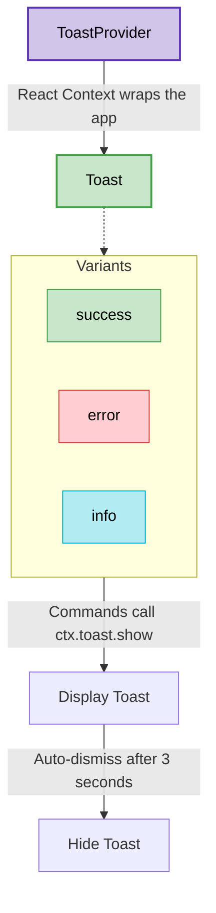

# Toast Notifications

Toasts provide brief, non-interruptive feedback about the outcome of an action (like a command succeeding or failing). They appear at the top-right of the terminal and automatically disappear after a few seconds.

## Folder Structure

The toast functionality introduces a new `providers` directory to manage global application state and context.

```text
src/
└── providers/
    └── toast/
        ├── index.tsx
        └── types.ts
```

## Architecture

Here is the flow of how Toast notifications are structured, matching **Step 1: Toast Notifications**.



## Implementation

The toast system is implemented using React Context (`ToastProvider`), which wraps the entire application. It provides a simple `show` function for displaying messages.

### `types.ts`
Defines the variants available (`success`, `error`, `info`) and the options interface.

```typescript title="packages/cli/src/providers/toast/types.ts"
export type ToastVariant = "success" | "error" | "info";

export type ToastOptions = {
  message: string;
  variant?: ToastVariant;
  duration?: number;
};

export const DEFAULT_DURATION = 3000;
```

### `index.tsx`
Contains both the `ToastProvider` context and the `Toast` UI component.

```tsx title="packages/cli/src/providers/toast/index.tsx"
import {
  createContext,
  useContext,
  useRef,
  useState,
  useCallback,
} from "react";
import type { ReactNode } from "react";
import { useTerminalDimensions } from "@opentui/react";
import type { ToastOptions, ToastVariant } from "./types";
import { DEFAULT_DURATION } from "./types";
import { SplitBorderChars } from "../../components/border";

export type ToastContextValue = {
  show: (options: ToastOptions) => void;
};

const ToastContext = createContext<ToastContextValue | null>(null);

export function useToast(): ToastContextValue {
  const value = useContext(ToastContext);
  if (!value) throw new Error(`useToast must be used within a ToastProvider`);

  return value;
}

type ToastProviderProps = {
  children: ReactNode;
};

export function ToastProvider({ children }: ToastProviderProps) {
  const [currentToast, setCurrentToast] = useState<ToastOptions | null>(null);
  const timeoutHandleRef = useRef<NodeJS.Timeout | null>(null);

  const clearCurrentTimeout = useCallback(() => {
    if (timeoutHandleRef.current) {
      clearTimeout(timeoutHandleRef.current);
      timeoutHandleRef.current = null;
    }
  }, []);

  const show = useCallback(
    (options: ToastOptions) => {
      const duration = options.duration ?? DEFAULT_DURATION;
      clearCurrentTimeout();

      setCurrentToast({
        variant: options.variant ?? "info",
        ...options,
        duration,
      });

      timeoutHandleRef.current = setTimeout(() => {
        setCurrentToast(null);
      }, duration).unref();
    },
    [clearCurrentTimeout],
  );

  const value: ToastContextValue = {
    show,
  };

  return (
    <ToastContext.Provider value={value}>
      {children}
      <Toast currentToast={currentToast} />
    </ToastContext.Provider>
  );
}

type ToastProps = {
  currentToast: ToastOptions | null;
};

function Toast({ currentToast }: ToastProps) {
  const { width } = useTerminalDimensions();
  if (!currentToast) {
    return null;
  }

  const variantColors: Record<ToastVariant, string> = {
    success: "#82E0AA",
    error: "#E74C5E",
    info: "#56D6c2",
  };
  const borderColor = currentToast.variant
    ? variantColors[currentToast.variant]
    : variantColors.info;

  return (
    <box
      position="absolute"
      justifyContent="center"
      alignItems="flex-start"
      top={2}
      right={2}
      width={Math.max(1, Math.min(60, width - 6))}
      paddingLeft={2}
      paddingRight={2}
      paddingTop={1}
      paddingBottom={1}
      backgroundColor="#1A1A24"
      borderColor={borderColor}
      border={["left", "right"]}
      customBorderChars={SplitBorderChars}
    >
      <box flexDirection="column" gap={1} width="100%">
        <text fg="#E1E1E1" wrapMode="word" width="100%">
          {currentToast.message}
        </text>
      </box>
    </box>
  );
}
```

## Integration

To integrate the Toast system into the CLI, several core files were modified to ensure the context is available globally and that commands can easily trigger notifications.

### 1. Global Provider
The `App` component in `packages/cli/src/index.tsx` was updated to wrap the entire layout in `<ToastProvider>`.

```tsx title="packages/cli/src/index.tsx"
// ...
import { ToastProvider } from "./providers/toast";

function App() {
  return (
    <ToastProvider>
      <box
        alignItems="center"
        justifyContent="center"
        backgroundColor="#0D0D12"
        width="100%"
        height="100%"
        gap={2}
      >
        <Header />
        <box width="100%" maxWidth={90} paddingX={2} flexDirection="column">
          <InputBar onSubmit={() => {}} />
        </box>
      </box>
    </ToastProvider>
  );
}
// ...
```

### 2. Contextual Types
The `ToastContextValue` was injected into the `CommandContext` so all slash commands have access to the toast API.

```tsx title="packages/cli/src/components/command-menu/types.ts"
import type { ToastContextValue } from "../../providers/toast";

export type CommandContext = {
  exit: () => void;
  toast: ToastContextValue;
};

// ...
```

### 3. Firing Actions
The `InputBar` was updated to consume `useToast()` and inject it into the `command.action` execution.

```tsx title="packages/cli/src/components/input-bar.tsx"
// ...
import { useToast } from "../providers/toast";

export function InputBar({ onSubmit, disabled = false }: Props) {
  // ...
  const toast = useToast();

  const handleCommand = useCallback(
    (command: Command | undefined) => {
      // ...
      if (command.action) {
        command.action({
          exit: () => renderer.destroy(),
          toast,
        });
      }
      // ...
    },
    [renderer, toast],
  );
  // ...
}
```

### 4. Command Data
Finally, the individual commands were updated to call `ctx.toast.show(...)` with success/info messages when executed.

```tsx title="packages/cli/src/components/command-menu/commands.tsx"
import type { Command } from "./types";

export const COMMANDS: Command[] = [
  {
    name: "new",
    description: "Start a new conversation",
    value: "/new",
    action: (ctx) => {
      ctx.toast.show({ message: "Starting new conversation..." });
    },
  },
  {
    name: "agents",
    description: "Switch agents",
    value: "/agents",
    action: (ctx) => {
      ctx.toast.show({ message: "Selecting agents..." });
    },
  },
  {
    name: "models",
    description: "Select AI model for generation",
    value: "/models",
    action: (ctx) => {
      ctx.toast.show({ message: "Selecting model..." });
    },
  },
  {
    name: "sessions",
    description: "Browse past sessions",
    value: "/sessions",
    action: (ctx) => {
      ctx.toast.show({ message: "Loading sessions..." });
    },
  },
  {
    name: "theme",
    description: "Change color theme",
    value: "/theme",
    action: (ctx) => {
      ctx.toast.show({ message: "Opening theme picker..." });
    },
  },
  {
    name: "login",
    description: "Sign in with your browser",
    value: "/login",
    action: (ctx) => {
      ctx.toast.show({ message: "Opening browser to sign in..." });
    },
  },
  {
    name: "logout",
    description: "Sign out of your account",
    value: "/logout",
    action: (ctx) => {
      ctx.toast.show({
        variant: "success",
        message: "Signed out",
      });
    },
  },
  {
    name: "upgrade",
    description: "Buy more credits",
    value: "/upgrade",
    action: (ctx) => {
      ctx.toast.show({ message: "Opening credits checkout..." });
    },
  },
  {
    name: "usage",
    description: "Open billing portal in your browser",
    value: "/usage",
    action: (ctx) => {
      ctx.toast.show({ message: "Opening billing portal..." });
    },
  },
  {
    name: "exit",
    description: "Quit the application",
    value: "/exit",
    action: (ctx) => {
      ctx.exit();
    },
  },
];
```
